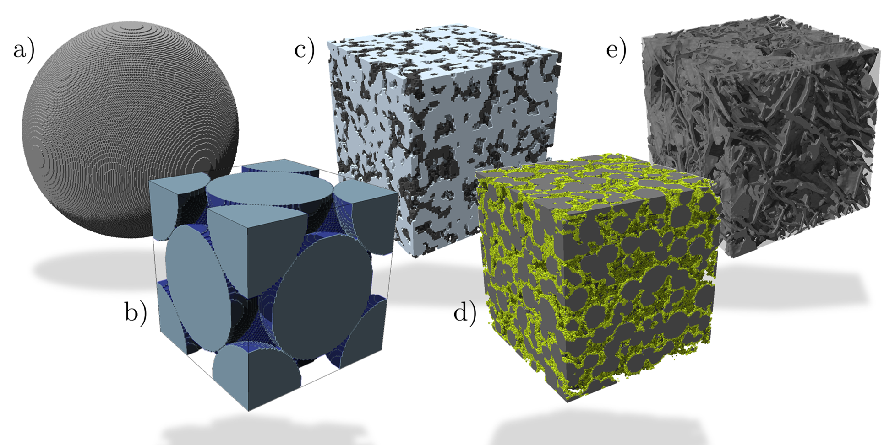

# Microstructure characterization of battery materials based on voxelated image data: Computation of active surface area and tortuosity

  </img>

## Description
This repository contains the python code to reproduce the results from [Daubner and Nestler 2024](add link). The abstract reads:

> The reliable computation of microstructure metrics such as specific surface area and tortuosity factors is key to bridge the gap between the battery microscale and fast, homogenized cell models.
In this work, we present an approach to compute the surface area of phases based on pixelated image data which is both easy-to-implement and computationally efficient. The concept is inspired from the diffuse surface representation in phase-field methods. Subsequently, the approach is validated and compared with common python libraries on two benchmark cases and actual battery microstructure data. The results underline the reliability and fast computational performance of the approach.
Furthermore, the concept of through-feature connectivity in pixelated image data is introduced and explored to quantify the reliability of tortuosity factor computations.
Overall, this work enhances the computational tools to bridge the scale from battery microstructures to cell models and gives an overview of state-of-the-art methodology. The developed code is published to further accelerate the scientific progress in this field.

The code is organized in two files containing all functions (`data.py`and `metrics.py`) and three jupyter notebook which contain all the computational studies discussed in the publication.
The following functions have been implemented for the computation of microstructure metrics and can be found in `metrics.py`
- `volume_fraction`: Count voxels of one phase (labelled by same integer value)
- `label_periodic`: label interconnected regions with same integer value and take periodicity for given directions into account. The structuring element defines if side, edge or even corner connectivity is taken into account
- `find_spanning_labels`: extract all labels which form a continuous connection in a given direction (i.e. appear at both sides of the given voxel array)
- `extract_through_feature`: combines labelleling and finding spanning labels to extract all through features which are then labelled as one while pore and all disconnected parts are labelled 0
- `largest_interconnected_feature`: follows the same idea but only tries to find the largest interconnected feature (which does not necessarily connect with the boundaries)
- `specific_surface_area_marching`: Computes the specific surface area based on the marching cubes algorithm implemented in scikit-image
- `specific_surface_area`: Computation of specific surface area based on the gradient norm motivated from the phase-field method

The tortuosity computation is based on [taufactor](https://taufactor.readthedocs.io/en/latest/usage.html).

## Installation
The code is based on python including the following libraries
- numpy
- scipy
- scikit-image
- taufactor
- porespy
- matplotlib
- imageio

## Usage
The usage is documented in the jupyter notebooks which can be used to reproduce the results of the publication.

## Authors and acknowledgment
This work contributes to the research performed at CELEST (Center for Electrochemical
Energy Storage Ulm-Karlsruhe) and was funded by the German Research Foundation
(DFG) under project ID 390874152 (POLiS Cluster of Excellence). B. N. acknowledges
scientific discussion within the community of the programme MTET no. 38.04.04 of
the Helmholtz association. The study of realistic battery microstructures was enabled
through the open-access publishing of segmented microstructure data by [Neumann et. al. 2024](https://chemistry-europe.onlinelibrary.wiley.com/doi/10.1002/batt.202300409), [Usseglio-Viretta et. al. 2018](https://iopscience.iop.org/article/10.1149/2.0731814jes/pdf) as well as [microlib](https://microlib.io).

## License
This code has been published under the MIT licence.
